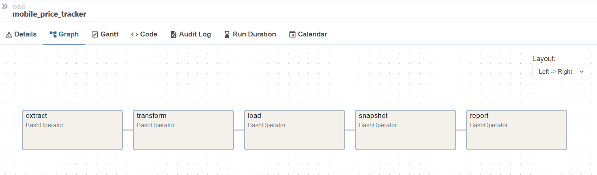

# Nepal Mobile Price Tracker

[](https://www.python.org/)
[](https://airflow.apache.org/)
[](https://www.postgresql.org/)
[](https://docs.docker.com/compose/)
[](LICENSE)

A daily ETL pipeline that scrapes mobile phone prices from two Nepali
e-commerce sites, cleans and loads them into PostgreSQL, tracks historical
price changes, and generates reports — all orchestrated with Apache Airflow.

---

## What it does

Every day at **06:00 UTC (11:45 AM NPT)**:

1. **Extract** — scrapes ~830 phone listings from NepalTechHub and Fatafat Sewa
2. **Transform** — cleans names, parses prices to integers, normalizes brands
3. **Load** — upserts into a PostgreSQL `mobile_prices` table
4. **Snapshot** — copies today's state into `price_history` for trend analysis
5. **Report** — writes daily price drops and rises to CSV

---

## Architecture

```text
┌─────────────────────┐
│    NepalTechHub     │  requests + BeautifulSoup
│  (server-rendered)  │
└──────────┬──────────┘
           │
           ▼
┌─────────────────────┐
│    Fatafat Sewa     │  Playwright (client-side pagination)
│    (Next.js SPA)    │
└──────────┬──────────┘
           │
           ▼
┌─────────────────────┐
│     extract.py      │  → data/raw/phones.csv
└──────────┬──────────┘
           │
           ▼
┌─────────────────────┐
│    transform.py     │  → data/processed/phones_clean.csv
└──────────┬──────────┘
           │
           ▼
┌─────────────────────┐
│      load.py        │  → mobile_prices table
└──────────┬──────────┘
           │
           ▼
┌─────────────────────┐
│    snapshot.py      │  → price_history table
└──────────┬──────────┘
           │
           ▼
┌─────────────────────┐
│     report.py       │  → reports/price_drops.csv
└─────────────────────┘

All 5 steps orchestrated by Airflow
(dag_id: mobile_price_tracker · retries=2 · schedule="0 6 * * *")
```

---

## Screenshots

**Airflow DAG — all 5 tasks green:**



---

## Tech stack

| Layer | Tool | Why |
|---|---|---|
| Scraping | `requests` + `BeautifulSoup` | Server-rendered sites |
| Scraping | `Playwright` | Client-side JS pagination (Fatafat) |
| Transform | `pandas` | CSV cleaning, deduping |
| Storage | PostgreSQL 16 | Relational analytics |
| Orchestration | Apache Airflow 2.9.3 | Scheduling, retries, logs, UI |
| Packaging | Docker + Compose | Reproducible environment |

---

## Quick start

### 1. Clone and configure

```bash
git clone https://github.com/AcharyaPratik/mobile-price-tracker.git
cd mobile-price-tracker
cp .env.example .env
# Optional: set AIRFLOW_UID to your host UID (id -u) to avoid root-owned logs
```

### 2. Spin up the stack

```bash
docker compose up -d --build
```

This starts PostgreSQL, the Airflow webserver, and the Airflow scheduler.
Airflow auto-imports the DAG from `dags/mobile_pipeline.py`.

First build takes ~5–7 min (Playwright downloads Chromium). Subsequent builds
are cached.

### 3. Open Airflow

- URL: http://localhost:8080
- Username: `admin`
- Password: `admin`

Toggle the `mobile_price_tracker` DAG **on**, then trigger a manual run to
populate the database immediately (otherwise it waits until 06:00 UTC).

### 4. (Optional) Run the pipeline manually without Airflow

```bash
python scripts/extract.py
python scripts/transform.py
python scripts/load.py
python scripts/snapshot.py
python scripts/report.py
```

---

## Project structure

```text
mobile-price-tracker/
├── dags/
│   └── mobile_pipeline.py      # Airflow DAG (dag_id: mobile_price_tracker)
├── scripts/
│   ├── extract.py              # Orchestrator: runs every source
│   ├── transform.py            # Clean + normalize
│   ├── load.py                 # Bulk insert into Postgres
│   ├── snapshot.py             # Daily price_history snapshot
│   ├── report.py               # Generate price-change CSVs
│   └── sources/
│       ├── nepaltechhub.py     # requests + BS4 scraper
│       └── fatafatsewa.py      # Playwright scraper
├── sql/
│   ├── schema.sql              # CREATE TABLE statements
│   └── analytics.sql           # Business queries
├── data/
│   ├── raw/                    # phones.csv (post-extract)
│   └── processed/              # phones_clean.csv (post-transform)
├── reports/                    # Generated CSVs
├── screenshots/                # README images
├── Dockerfile
├── docker-compose.yml
├── requirements.txt
├── .env.example
└── README.md
```

---

## Data model

**`mobile_prices`** — current state of every phone

| Column | Type | Notes |
|---|---|---|
| id | serial | primary key |
| source | varchar(50) | `nepaltechhub` or `fatafatsewa` |
| name | varchar(255) | cleaned product name |
| brand | varchar(100) | normalized (e.g. "Motorola") |
| price | numeric(10,0) | NPR integer, no decimals |
| price_category | varchar(20) | budget / mid-range / premium / flagship |
| url | text | source URL (used for dedup) |
| scraped_at | timestamp | when the source was scraped |
| created_at | timestamp | when the row was inserted |

Unique index on `(source, url)` — re-running the loader is idempotent.

**`price_history`** — daily snapshots

| Column | Type | Notes |
|---|---|---|
| id | bigserial | primary key |
| source, url, name, brand, price | (same as above) | |
| snapshot_date | date | one row per phone per day |
| captured_at | timestamp | insertion time |

---

## Example queries

**Cheapest phones per brand:**

```sql
SELECT DISTINCT ON (brand) brand, name, price
FROM mobile_prices
ORDER BY brand, price ASC;
```

**Average price by brand:**

```sql
SELECT brand,
       COUNT(*) AS models,
       ROUND(AVG(price)) AS avg_price
FROM mobile_prices
GROUP BY brand
ORDER BY avg_price DESC;
```

**Biggest price drops today:**

```sql
WITH today AS (
    SELECT url, name, brand, price
    FROM price_history WHERE snapshot_date = CURRENT_DATE
),
yesterday AS (
    SELECT url, price
    FROM price_history WHERE snapshot_date = CURRENT_DATE - 1
)
SELECT t.brand, t.name,
       y.price AS old_price,
       t.price AS new_price,
       t.price - y.price AS change
FROM today t JOIN yesterday y ON y.url = t.url
WHERE t.price < y.price
ORDER BY change ASC
LIMIT 10;
```

More queries in [`sql/analytics.sql`](sql/analytics.sql).

---

## Disclaimer

This project is built for **educational purposes** to demonstrate an
end-to-end ETL pipeline. Product names, prices, and images belong to their
respective owners. Data is scraped from publicly available pages and is not
redistributed.

---

## License

Released under the [MIT License](LICENSE).